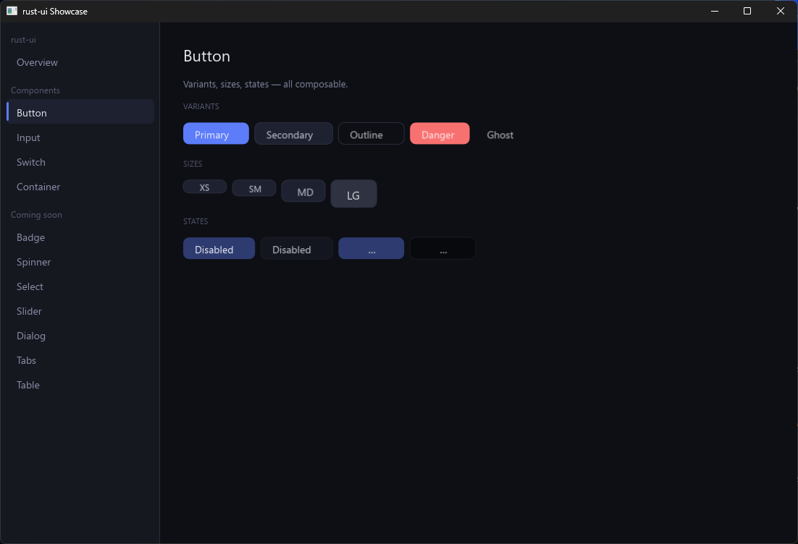
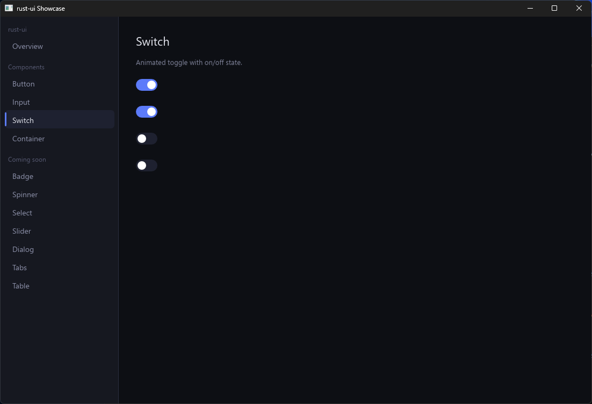

# rust-ui

> 为 Rust 桌面应用设计的美观、易用 UI 库。

---

**[English →](./README.md)**

---

## 为什么要再造一个 UI 库？

| 现有库的问题 | rust-ui 的答案 |
|---|---|
| 样式需要写 20 行闭包 | `Style` 是一个普通值 — 定义一次，随处复用 |
| 没有类 CSS 的继承/层叠 | `style.merge(other)` — 后者覆盖前者，和 CSS 优先级一致 |
| 动画需要大量样板代码 | `AnimationScheduler` 统一管理所有补间，每帧 tick 一次 |
| 渲染后端写死 | `Renderer` trait — 随时替换 wgpu、skia 或测试后端 |
| API 冗长，难以上手 | 链式 Builder API，命名参考 SwiftUI + shadcn/ui |

## 快速开始

```rust
use rust_ui::prelude::*;

let ui = column![
    text("你好，rust-ui！").size(24.0).bold(),
    text("副标题").color(Color::hex("#8b8fa8")),
    button("开始使用")
        .on_click(|| println!("点击了！")),
]
.spacing(12.0)
.padding(24.0);

rust_ui_wgpu::run("我的应用", 800, 600, ui, Theme::dark());
```

运行交互式 showcase：

```bash
cargo run -p showcase
```

## 截图






## 文档

- [组件文档](docs/components/) — Button、Input、Switch 等
- [组件文档（中文）](docs/components/button.zh.md) — Button、Input、Switch 等
- [指南](docs/guides/) — 主题定制、动画系统、布局
- [指南（中文）](docs/guides/theming.zh.md) — 主题定制、动画系统、布局

## 架构

```
rust-ui               核心库 — 零 GPU 依赖
  ├── color           Color，支持 hex() / lerp()
  ├── style           Style（可组合）、Theme（dark / light）
  ├── render          Renderer trait — 后端契约
  ├── event           输入事件类型
  ├── layout          Flexbox 布局引擎（基于 taffy）
  ├── animation       AnimationScheduler + Easing
  └── widget
        ├── Button    Primary / Secondary / Danger / Ghost 变体
        ├── Text      大小、颜色、粗体、字体族
        ├── Input     HTML 风格编辑：光标、选区、剪贴板、IME、滚动
        ├── Switch    带动画的开关
        ├── Row       水平 flex 容器
        ├── Column    垂直 flex 容器
        └── Container 带 padding / border / radius 的样式盒子

rust-ui-wgpu          wgpu + vello + winit 渲染后端
  ├── renderer        VelloRenderer 实现 Renderer trait
  ├── text            cosmic-text 字体塑形
  └── window          winit 事件循环 + 帧泵
```

## 组件路线图

参考 [shadcn/ui](https://ui.shadcn.com/docs/components) 的组件集规划。

### ✅ 第一阶段 — 基础（已完成）
- [x] Color、Style、Theme
- [x] Renderer trait + wgpu/vello 后端
- [x] AnimationScheduler
- [x] Button、Text、Input、Switch、Row、Column、Container
- [x] counter、gallery 示例正常运行

### 🔨 第二阶段 — 核心组件
- [ ] `Badge` — 状态小标签
- [ ] `Separator` — 水平/垂直分割线
- [ ] `Spinner` — 加载动画（验证 AnimationScheduler）
- [ ] `Avatar` — 圆形图片/文字占位符
- [ ] `Button` 尺寸变体：`xs / sm / md / lg`

### 📦 第三阶段 — 交互组件
- [ ] `Select` — 下拉选择器
- [ ] `Checkbox` — 多选框
- [ ] `Radio` — 单选组
- [ ] `Slider` — 拖拽数值
- [ ] `Tooltip` — 悬停提示
- [ ] `Dropdown Menu` — 右键/点击弹出菜单
- [ ] `Dialog / Modal` — 对话框（带焦点陷阱）
- [ ] `Tabs` — 标签页切换

### 📊 第四阶段 — 数据与布局
- [ ] `Table` — 虚拟化行，支持万级数据流畅渲染
- [ ] `ScrollView` — 虚拟化滚动列表
- [ ] `Progress` — 进度条
- [ ] `Toast` — 短暂通知
- [ ] `Accordion` — 折叠展开面板
- [ ] `Sidebar` — 导航侧边栏
- [ ] `Resizable` — 可拖拽调整大小的面板

### ✨ 第五阶段 — 打磨
- [ ] 从 TOML 文件热重载主题
- [ ] 可访问性支持（a11y 元数据）
- [ ] SVG 图标支持
- [ ] `cargo add rust-ui-cli` — 类 shadcn 的组件安装器

## 与其他 Rust UI 库的对比

| | rust-ui | iced | egui | gpui |
|---|---|---|---|---|
| 样式系统 | ✅ 可组合 Style | ❌ 闭包 | ❌ 即时模式 | ✅ 较好 |
| 动画 | ✅ 集中调度器 | ⚠️ 需手动 | ❌ | ✅ |
| 链式 Builder API | ✅ | ⚠️ | ⚠️ | ❌ |
| 渲染后端可替换 | ✅ | ✅ | ❌ | ❌ |
| 跨平台 | 🔨 开发中 | ✅ | ✅ | ⚠️ macOS 为主 |

## 许可证

MIT
