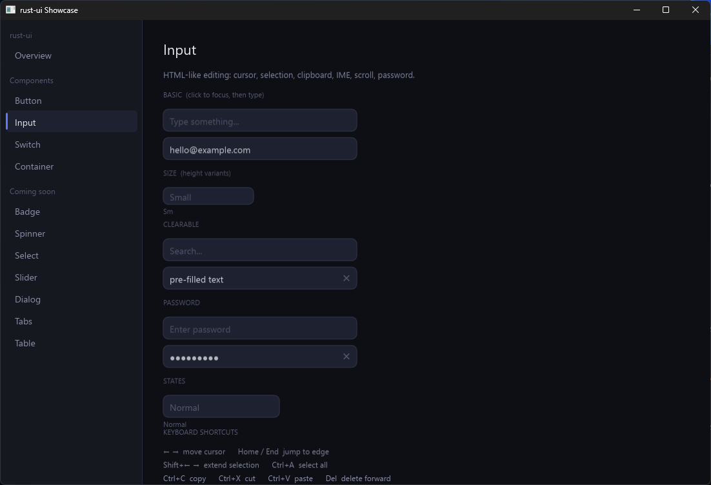

# Input

HTML-like text input with cursor, selection, clipboard, IME, and scroll.

## Basic Usage

```rust
use rust_ui::widget::{input, InputSize};

input("").placeholder("Type something...").width(300.0);
input("hello@example.com").placeholder("Email").width(300.0);
```

## Size (Height Variants)

```rust
input("").placeholder("Small").size(InputSize::Sm).width(140.0);
input("").placeholder("Medium (default)").size(InputSize::Md).width(180.0);
input("").placeholder("Large").size(InputSize::Lg).width(140.0);
```

## Clearable

```rust
input("").placeholder("Search...").clearable().width(300.0);
```

## Password

```rust
input("").placeholder("Enter password").password().width(300.0);
input("secret123").password().clearable().width(300.0);
```

## Events

```rust
input("")
    .on_change(|text| println!("Value: {}", text))
    .on_submit(|text| println!("Submitted: {}", text))
    .on_clear(|| println!("Cleared"));
```

## Keyboard Shortcuts

| Shortcut | Action |
|----------|--------|
| `←` `→` | Move cursor left/right |
| `Shift + ←` `→` | Extend selection |
| `Home` / `End` | Jump to start/end |
| `Shift + Home` / `End` | Extend selection to edge |
| `Ctrl + A` | Select all |
| `Ctrl + C` | Copy selection |
| `Ctrl + X` | Cut selection |
| `Ctrl + V` | Paste from clipboard |
| `Backspace` | Delete character before cursor |
| `Delete` | Delete character after cursor |
| `Enter` | Submit (triggers `on_submit`) |
| `Escape` | Cancel IME preedit or unfocus |

## IME Support

Chinese/Japanese/Korean input methods are fully supported. Preedit text is shown underlined before commit.


